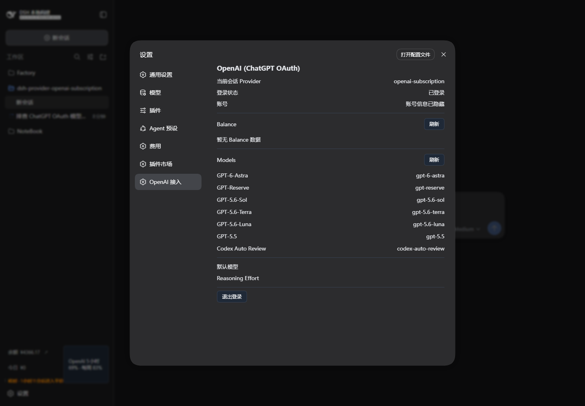

# dsh-provider-openai-subscription

`dsh-provider-openai-subscription` 是面向 DeepSeek Harness（DSH）的独立 OpenAI / ChatGPT 订阅 Provider。插件使用 ChatGPT OAuth 凭据访问 Codex Responses 接口，并向 DSH 提供模型目录、流式生成、订阅额度查询和 Web 设置界面。

> 本插件连接的是 ChatGPT / Codex 订阅所使用的非公开接口，不是 OpenAI Platform API。启用前，请自行确认账号、OAuth Client ID 和相关接口的使用风险。

## 效果预览

下面是插件在 DSH Web 设置页中的实际效果。截图中的账号信息已隐藏。



## 功能

- 支持授权码、手动回调和设备码三种 ChatGPT OAuth 登录流程。
- 注册独立 Provider ID `openai-subscription`，不占用 `dsh-codex`、`dsh-codex-connect` 或 `llm-pi-ai/openai-codex` 的标识。
- 构造 OpenAI Responses 请求，并将 SSE 事件转换为 DSH 流式输出。
- 查询模型目录，包括上下文窗口和 reasoning effort 信息。
- 查询订阅额度，支持缓存、并发请求合并和过期数据回退。
- 提供 DSH Web 设置页、首次启动引导、模型列表和退出登录功能。
- 检测旧 `openai-codex` Provider，并支持对旧凭据创建加密备份。
- 提供 Rescue CLI，可查看状态、启用或禁用插件、管理快照以及执行安装检查。
- 使用安全 Bootstrap。插件加载失败时，DSH 仍可继续启动。

## 安全加载

插件遵循一个简单原则：插件自身可以停用，但不能因为加载失败而阻止 DSH 重启。

Cordis 启动时只加载 `src/index.js` 和 `src/bootstrap.js`。只有同时满足以下条件，插件才会动态加载 Runtime：

- `state` 设置为 `active`；
- `oauth.clientId` 已配置且不为空；
- 未通过 Rescue CLI 启用 kill switch。

Runtime 加载或初始化失败时，Bootstrap 会捕获错误并停止激活插件，不会把异常继续抛给 DSH Loader。即使 DSH 本身无法进入 Web 设置页，也可以通过独立的 Rescue CLI 禁用插件。

## 安装与激活

在 DSH 源码目录或已经安装 DSH 的环境中添加插件：

```sh
dsh plugin --profile web add ../dsh-provider-openai-subscription
```

安装后，插件默认处于 `bootstrap` 状态，不会加载 Runtime。确认配置无冲突后，在对应 profile 中显式激活：

```yaml
- id: llm-openai-subscription
  name: dsh-provider-openai-subscription
  config:
    state: active
    oauth:
      clientId: "<your-client-id>"
    provider:
      defaultModel: ""
      reasoningEffort: ""
```

重新启动对应的 DSH profile，然后在 Web 设置页完成 ChatGPT OAuth 登录。

如需立即停用插件，可以运行：

```sh
dsh-openai-subscription-rescue disable
```

## 配置

| 字段 | 说明 |
|---|---|
| `state` | 可选值为 `bootstrap`、`disabled` 或 `active`。只有 `active` 会加载 Runtime。 |
| `oauth.clientId` | OAuth Client ID。留空时不加载 Runtime。 |
| `provider.defaultModel` | 默认模型 ID，可以留空。 |
| `provider.reasoningEffort` | 默认 reasoning effort，可以留空。 |

插件使用独立的 Provider ID、设置命名空间和凭据键，不会覆盖旧 `openai-codex` Provider 的配置或凭据。

## Web 设置页

Runtime 激活后，插件会在 DSH Web 客户端注册设置入口。登录成功后，可以在页面中查看：

- 当前 ChatGPT 账号；
- 订阅方案与额度窗口；
- 上游返回的模型目录；
- 默认模型和 reasoning effort 配置；
- 旧 Provider 的检测与备份状态。

左下角的额度指示器可以拖拽到页面任意位置，双击复位；拖动后按自身文本自适应宽度，完整显示额度内容，位置保存在浏览器本地。恢复位置、拖动结束或窗口变小时，指示器会避让该位置已有的可交互 UI，并自动收回可见区域。

侧边栏底部是所有 footer 操作共享的一行，不是指示器独占的整行（`dsh-cost-meter` 等插件也注册在同一席位）。选中 OpenAI 订阅 Provider、指示器出现时，它会让该行可以换行，并把自己排在其它操作之前、独占一整行，因此显示在已有 UI 的上方，而不是和它们挤在同一行或覆盖它们。指示器浮出、或该 Provider 不再被选中后，这一行的布局会恢复原状。

浏览器只访问插件注册的本地同源路由。OAuth token、额度请求和模型请求均由 DSH Runtime 发往上游接口。

## DSH 工具权限

Provider 会把 DSH 工具 schema 转换为模型可用的 Responses 工具定义。普通参数保持不变，但不会向模型暴露 `sandbox_permissions` 和 `justification`。

这两个字段由 DSH 的审批和权限系统管理，用于对单次工具调用进行严格的权限加宽。它们不是普通业务参数。在会话已经处于 `danger-full-access` 时，继续申请同级权限会被 DSH 以 `not strictly wider` 拒绝，模型可能因此重复提交相同请求。隐藏这些字段后，模型无法进入该重试循环。若命令被受限文件策略拒绝，模型应提示用户切换 DSH 权限预设。

相关实现位于 `src/provider/request-builder.js` 的 `buildResponsesTools`。

## Rescue CLI

Rescue CLI 不依赖插件 Runtime，可在 Web 设置页或 DSH 启动异常时单独运行。

```sh
# 查看脱敏状态
dsh-openai-subscription-rescue status

# 检查依赖和激活条件
dsh-openai-subscription-rescue doctor --profile path/to/profile/package.json

# 创建或回滚快照
dsh-openai-subscription-rescue snapshot
dsh-openai-subscription-rescue rollback

# 启用或禁用插件
dsh-openai-subscription-rescue enable
dsh-openai-subscription-rescue disable
```

所有状态输出都会脱敏。OAuth access token、refresh token 和备份密码不会写入日志或状态响应。

## 迁移与共存

插件发现旧 `openai-codex` Provider 后只报告状态，不会自动复制、删除或刷新旧凭据。需要迁移时，可以先用密码创建旧凭据的加密备份，再登录新的 `openai-subscription` Provider。

新旧 Provider 使用不同的凭据键和设置命名空间，可以同时存在并按会话切换。当前会话使用旧 Provider 时，本插件不会查询或显示 `openai-subscription` 的额度，客户端和桌面壳也不会为它请求上游额度接口。

## 常见问题

### 模型目录提示 `Model catalog request failed: fetch failed`

这条错误表示 Node.js 在收到 HTTP 响应前未能完成网络请求。它通常与 DNS、TLS、代理、VPN 或 TUN 网络状态有关，并不等同于 OAuth 凭据失效。

可以按以下顺序检查：

1. 在设置页重新刷新模型目录；
2. 确认运行 DSH 的 Node.js 进程可以访问 `chatgpt.com`；
3. 检查代理规则是否允许访问 `chatgpt.com` 和 `auth.openai.com`；
4. 如果浏览器可以访问但 DSH 不行，检查启动 DSH 的终端是否配置了正确的 `HTTP_PROXY`、`HTTPS_PROXY` 或 TUN 路由；
5. 网络恢复后重启对应的 DSH profile，清除页面中保留的旧错误状态。

凭据被拒绝时，插件会返回需要重新登录的明确错误；上游返回异常状态时，错误中会包含 HTTP 状态码。只有看到这些提示时，才需要优先检查登录状态或上游接口。

### 修改源码后，刷新浏览器仍未生效

Runtime 由 DSH profile 加载。修改源码后需要重新启动对应 profile，仅刷新浏览器页面不会重新加载 Runtime。

## 开发与测试

```sh
npm test                  # 运行全部单元测试
npm run check             # 语法检查并运行全部单元测试
npm run test:integration  # 运行真实 DSH 组合 smoke；缺少依赖时安全跳过
```

## 目录结构

```text
src/
  index.js                 Cordis 插件入口
  bootstrap.js             安全引导与失败隔离
  runtime.js               Runtime 装配，包括凭据、OAuth、额度、路由和 adapter
  config.js                配置归一化与激活判断
  state.js                 DSH_HOME 下的 kill switch 状态
  conflicts.js             Provider、namespace 与凭据冲突检查
  rescue.mjs               Rescue CLI
  credentials/             凭据 schema、repository 和 token manager
  oauth/                   PKCE、state、JWT、callback 和 device code
  balance/                 额度客户端、响应归一化与缓存服务
  models/                  模型目录客户端
  provider/
    request-builder.js     Responses 请求构造与工具 schema 转换
    adapter.js             OpenAI 订阅 Provider adapter
    event-translator.js    Responses SSE 到 DSH chunk 的转换
  stream/                  SSE parser
  web/                     本地同源 Web API 路由
client/
  client.js                设置页、首次启动引导和额度 UI
test/                      Node.js 单元测试
cordis.patch.yml           DSH bundle patch 定义
```

## 已知限制

- OAuth、模型目录和额度接口的完整验证需要真实账号及明确授权。
- ChatGPT / Codex 非公开接口可能随时调整协议或返回字段。
- 高级模型配置 UI 尚未覆盖 Provider 的全部参数。

## 许可证

MIT
